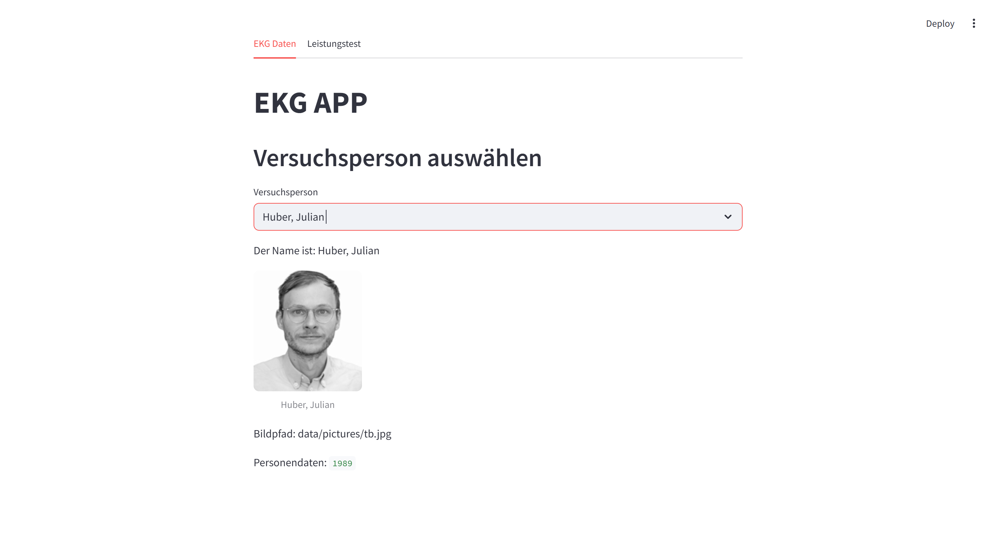
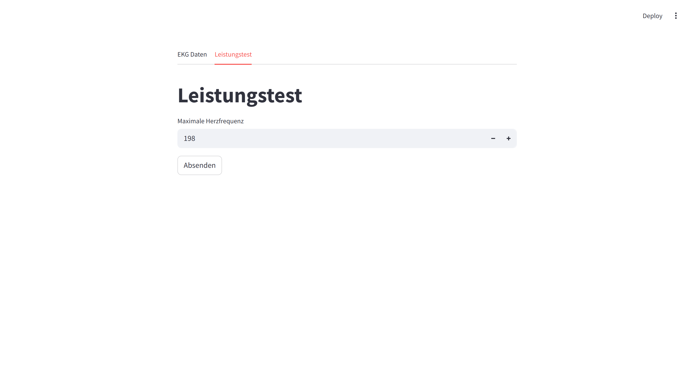
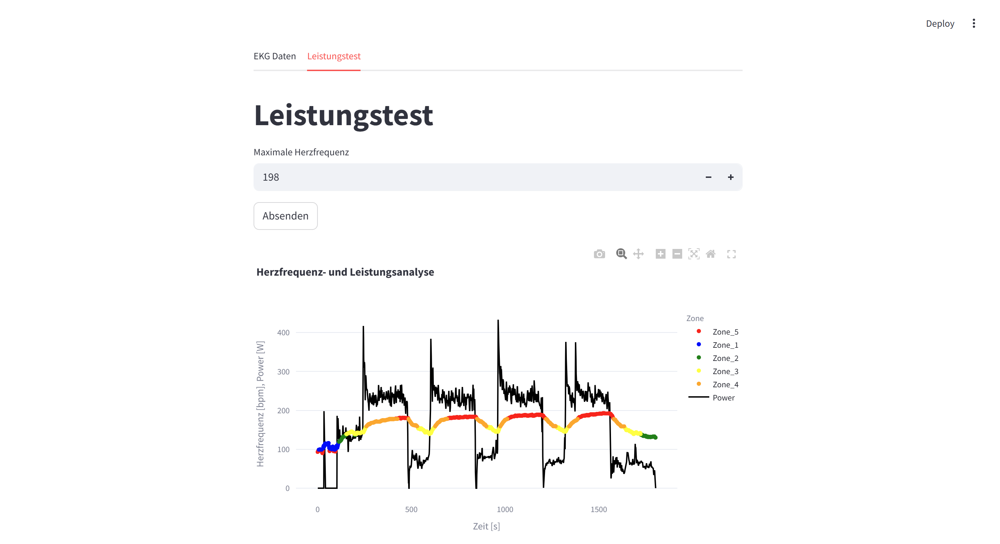
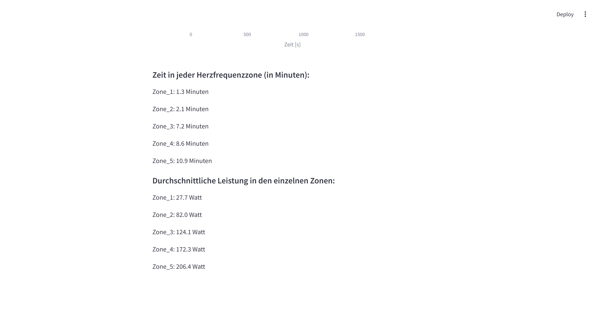
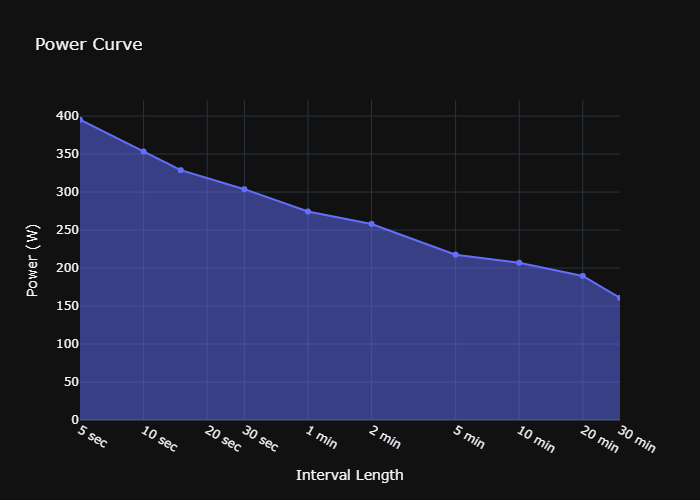

# Pue_A2-5
# Abgabe interaktiver Plot
# 🚴 Leistungstest-Analyse – Interaktive Streamlit App

Diese App ist Teil der Abgabe **„Interaktiver Plot“** im Rahmen der Veranstaltung PÜE. Sie analysiert Daten eines Leistungstests basierend auf einer `activity.csv`-Datei und stellt sie interaktiv dar. Zusätzlich zur Power Curve wurde ein zweiter Tab mit detaillierter Leistungs- und Herzfrequenzanalyse implementiert.

## 🔧 Funktionen der App

### Tab 1: Power Curve
- Lädt die Leistungsdaten aus einer CSV-Datei
- Berechnet eine Power Curve über definierte Zeitintervalle
- Visualisiert diese Kurve mit einem interaktiven Plotly-Plot

### Tab 2: Leistungstest-Auswertung
- Lädt Leistungs- und Herzfrequenzdaten
- Zeigt:
  - Mittelwert und Maximalwert der Leistung
  - Interaktiven Plot (Leistung und HF über Zeit)
  - Aufteilung in 5 Herzfrequenz-Zonen (einstellbar via Max HF)
  - Verweildauer in den Zonen (in Minuten)
  - Durchschnittliche Leistung je Zone

## ▶️ Starten der App

Das Projekt ist als [PDM](https://pdm.fming.dev/latest/) Projekt organisiert.

### 1. Klonen

```bash
git clone https://github.com/Mani5623/Pue_A2-5.git
cd Pue_A2-5
```

### 2. Setup (mit PDM)

```bash
pdm install
```

### 3. Setup (mit PDM)
Bibliotheken insallieren
```bash
pdm add "Name der Bibliothek"
```

### 4. Starten

```bash
streamlit run app.py
```

> Alternativ: `main.py` starten für Power-Curve-Berechnung.

## 🗂️ Projektstruktur

```text
Pue_A2-5/
├── app.py               # Streamlit App mit Tabs
├── main.py              # Power Curve Analyse (ohne Streamlit)
├── data/
│   └── activities/
│       └── activity.csv
├── powercurve/
│   └── powercurve.py    # Funktionen zur Power Curve
├── .gitignore
├── README.md            # Dieses Dokument
└── screenshot.png       # Screenshot der App (für Abgabe)
```
# 🚴 Leistungstest-Analyse – Interaktive Streamlit App

Diese App ist Teil der Abgabe **„Interaktiver Plot“** im Rahmen der Veranstaltung PÜE. Sie analysiert Daten eines Leistungstests basierend auf einer `activity.csv`-Datei und stellt sie interaktiv dar. Zusätzlich zur Power Curve wurde ein zweiter Tab mit detaillierter Leistungs- und Herzfrequenzanalyse implementiert.

---

## 📈 Teil 2: Leistungskurve II

In diesem Teil wird eine **Power Curve** berechnet – also die höchste durchschnittliche Leistung, die für verschiedene Zeitintervalle gehalten wurde. Diese Berechnung erfolgt aus einer Watt-Zeitreihe (in unserem Fall `Power Original` in `activity.csv`), **ohne dass eine Zeitspalte notwendig ist**.

### 🧠 Vorgehen:
- **`load_data()`**: Liest die Leistungsdaten aus der CSV-Datei und gibt eine Serie oder ein NumPy-Array zurück.
- **`find_best_effort()`**: Sliding-Window-Algorithmus zur Berechnung der besten durchschnittlichen Leistung für ein bestimmtes Zeitfenster.
- **`create_power_curve()`**: Erstellt ein DataFrame mit den besten Durchschnittsleistungen für vorgegebene Zeitintervalle.
- **`plot_power_curve()`**: Visualisiert die Power Curve mit Plotly.

Die Berechnung erfolgt auch unabhängig von gleichmäßigen Zeitabständen – wichtig ist nur, dass das Intervall (z. B. 1 Hz, also 1 Wert pro Sekunde) übergeben wird.

Die Funktionalität ist testbar via `main.py`.

---

## 🖼️ Screenshot






